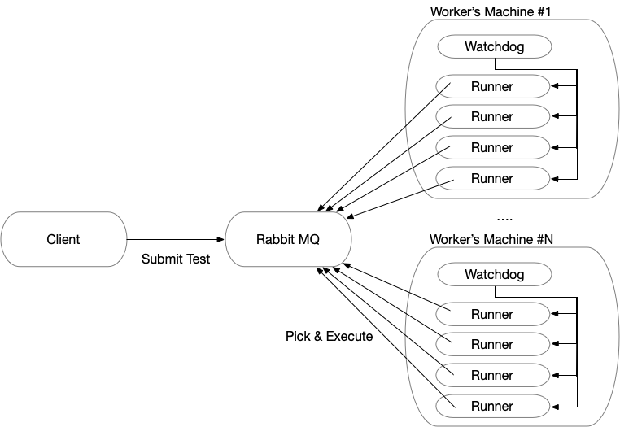

Remote Test Workers
===================

This project implements a way of distributing the execution of tests in multiple images running in the same or different machines. This version includes the following high-level features:

- Integration with Dr Test to execute the test classes in the cluster.
- Uses RabbitMQ to handle all communications, allowing to scale without problem.
- A watchdog to deploy in the machines running worker instances.
- A client to monitor the available worker instances.
- A way of publishing changes to the images, and also in the future to share the cluster between different users.
- Different strategies to generate the templates (from an existing image, from latest Pharo, from the same image that the client).
- Integration with the Pharo tools and UI.

This version uses RabbitMQ to distribute tests to the different worker instances, and also to communicate the watchdogs, the instances and the clients. It uses the STOMP client implementation for Pharo (https://github.com/svenvc/stamp).

This diagram shows a simplify description of the test distribution.



More detailed information of each of the elements of the solution:

- [Test Execution](./docs/testExecution.md)
- [Queue Architecture](./docs/queues.md)
- [Watchdog Architecture](./docs/watchdog.md)
- [Changes Propagation](./docs/changePropagation.md)


## Installation

Execute the following Metacello baseline load script

```Smalltalk
Metacello new
	baseline: 'pharo-testWorkers';
	repository: 'github://tesonep/pharo-testWorkers/repository';
	load
```
