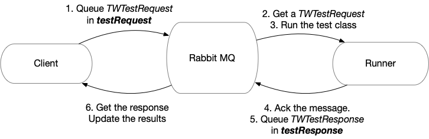
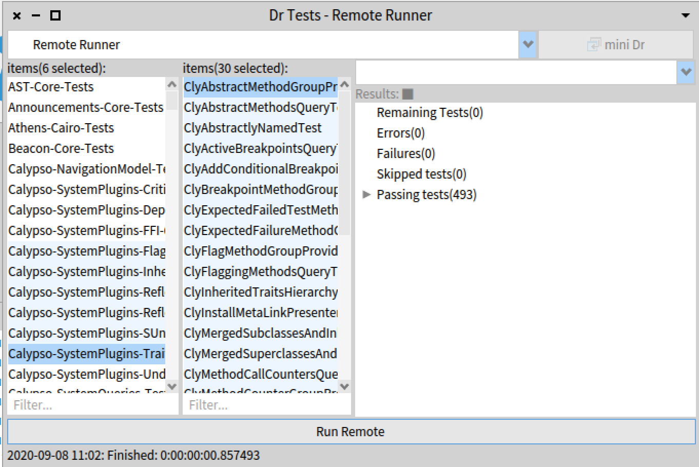

Test Planification and Execution
================================

The client instances have a singleton instance of TWClient. 
This unique instance is in charge of sending the test request, waiting for the results, combining the result and it is used as the backend of the Dr.Test plugin.

The client (`TWClient`) generates a message per test class. 
This is the distribution unit of the platform. The test classes are sent to the message broker in random order.
The message broker will then distribute the messages in a round-robin fashion. 
Each of the runner instances (`TWRunner`) takes a a single message to process. 
When a runner process a message, the runner ACK the message.

The test request is of the class `TWTestRequest` and it only includes the name of the Test class.
If the class does not exists in the runner instances, it is handled as an execution error.

Test execution might end in two different flavors:

- Correct execution, maybe producing a passed, failure or skip test (even if the test is executed producing an exception)/
- An error to execute the test (the test cannot be executed, for example, the test class does not exists or there is a communication problem). 

For the first scenario, the Runner answers a `TWTestResponse`. This object includes the result of executing the whole suite defined by the test class. This partial test result is later combined by the client to present a single test result set to the user. 

If there is an error, the runner answers a `TWTestExecutionError` including the serialized exception and the message of the exception. In case that the exception cannot be serialized (for example when an obsolete class is found), the message is sent without the serializedException (it is nil).

Queues and Process
==================

When the client want to execute a test, a new `TWTestRequest` instance is created.
This instance has a UUID (that of course, it is unique) and the name of the test class to execute. 
As said, the unit of execution is the test class. If the class has many test selectors, all of them will be executed by the same runner.

The client sends the message to the queue named "testRequest".
All the workers are subscribed to this queue, so this is a round-robin queue. 

Once the request is enqueued, the client record its UUID and the request to know what are the remaining tests to execute. 
The client sends all the request at the same time, one after the other.

When a `TWTestRequest` message is taken by one of the runners, it executes it. 
Putting the resulting message (`TWTestResponse` or `TWTestExecutionError`) in the "testRequest" queue.

The single consumer of the "testRequest" queue is the `TWClient` instance. 
It fetch the incoming message and process them. 
If the message is a successful execution (`TWTestResponse`), the client merge the result that is accumulating and the ones coming in the message. So, it can always have the accumulated results of the tests.
if the message is notifying an error (`TWTestExecutionError`), the client accumulates the result in an special collection to show the execution problems to the user.

Once all the pending execution have been answered (as it has the UUID for detecting them), the client can safely end and disconnect if wish so.

Dr Test Plugin
==============

The execution of tests with the remote runner it is integrated as a new DrTest plugin. 
The DrTest plugin (`TWRemoteTests`) extends the UI of DrTest with a new option for the runner. 
Then it later delegates in the client (`TWClient`) to execute the tests in the cluster of workers.
The plugin is connected to the client and each update in the client (for example, when a test response arrives) generates the update of the UI.

This integration relies in the `TWClient` unique instance to submit the tests and getting the answers.
